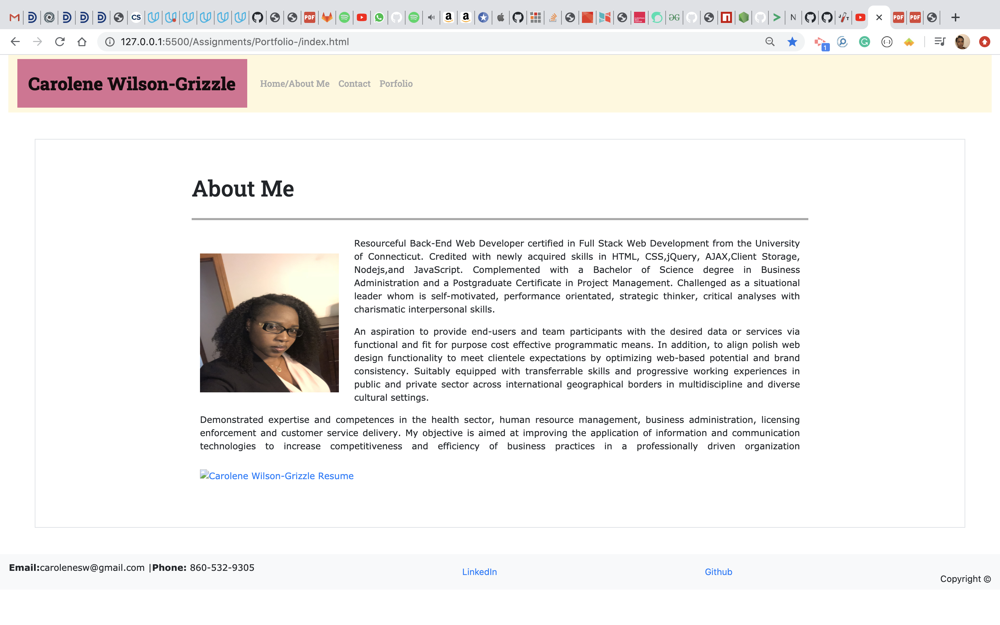

# Portfolio 

## User Story 

Create a Profile/About Me responsive design web application that render on different devices and screen sizes. 

## Techonology

- HTML/CSS
- Bootstrap
- Google Fonts  

## Userbility

- This website should render on extra small screens to large screen sizes, with responisve layout
    - On extra smaller screens website should take up the entire page
    - On small and larger screens website should have margins on the left and right of the page
- Website nav-bar should be consistent on all pages 
- Page should follow HTML validation services
- Nav-bar on each pages must have links to Home/About Me, Contact and Portfolio pages that work
- Website must contains developer personal information:
    - Developer's bio 
    - Name
    - Picture
    - Active links to social media 
        -- GitHub profile & LinkedIn page
        -- Email address and phone number
        -- Link to a PDF of your resume
    - List of projects with the following:
        -- Project title
        -- Link to the deployed version
        -- Link to the GitHub repository

Screenshot of the deployed application
- Website must properly utilized bootstrap grid system and components:
    - Rows and columns 
    - Responsive design 

## link

https://carolenesw.github.io/Portfolio-/

## Images

